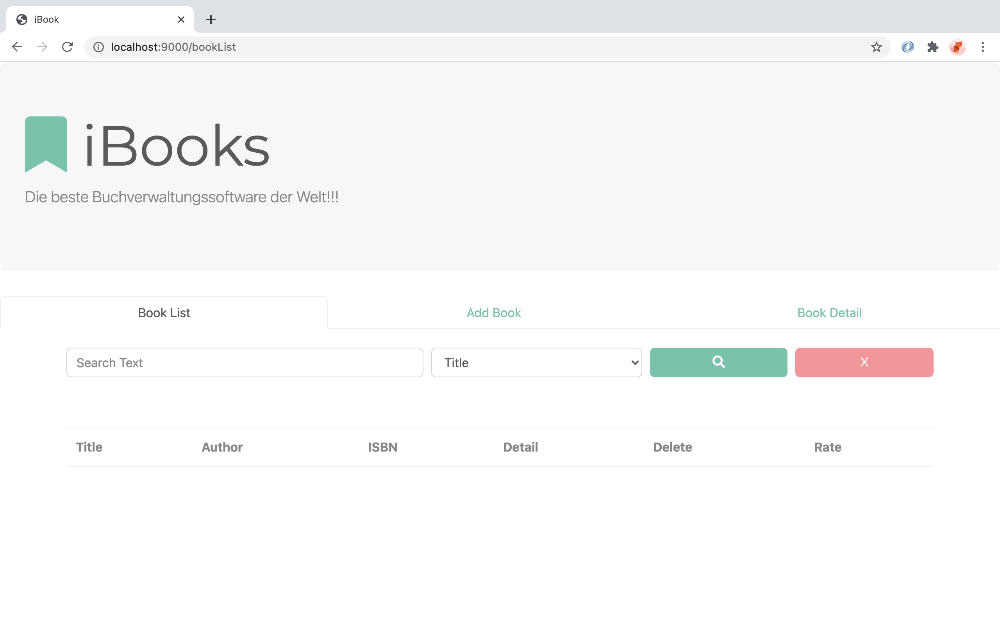
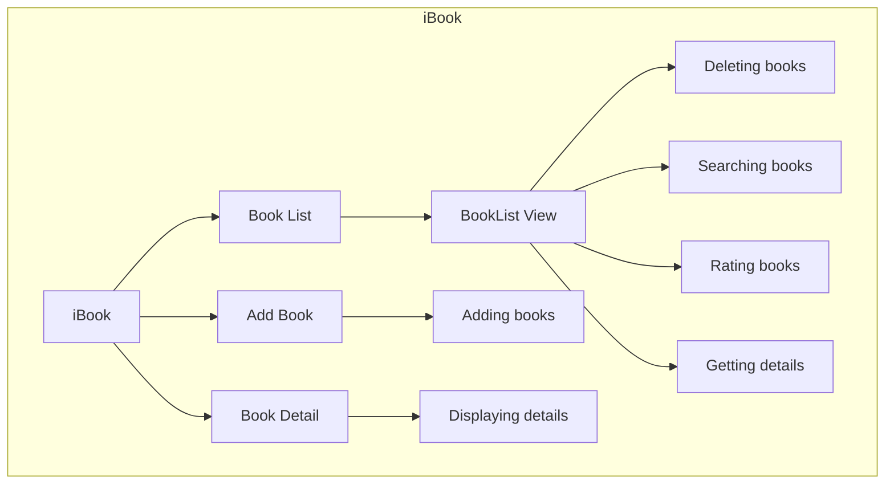
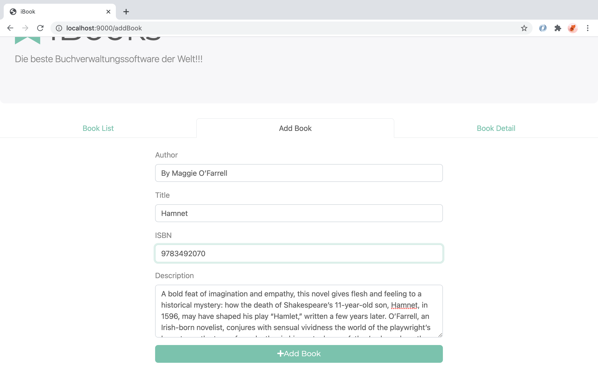
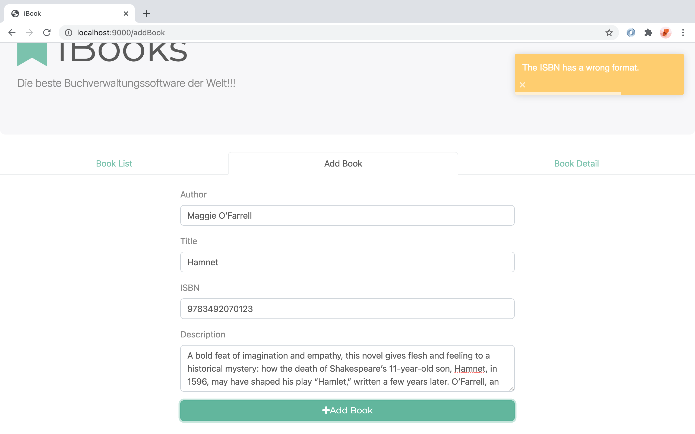
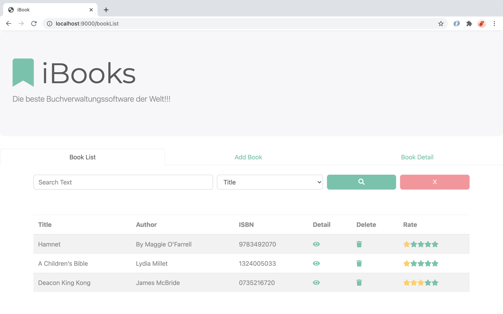
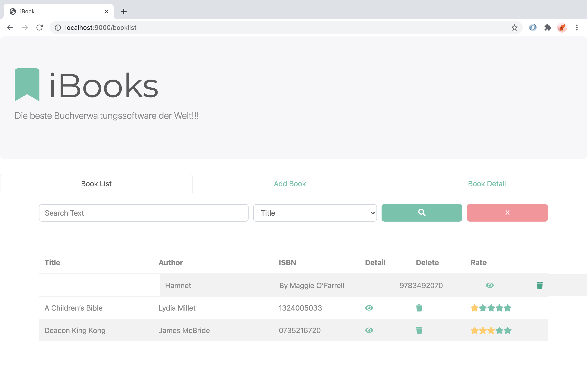
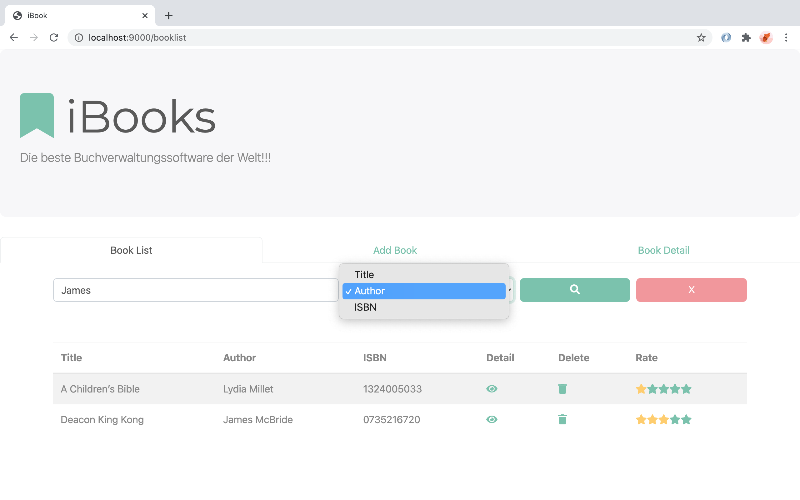
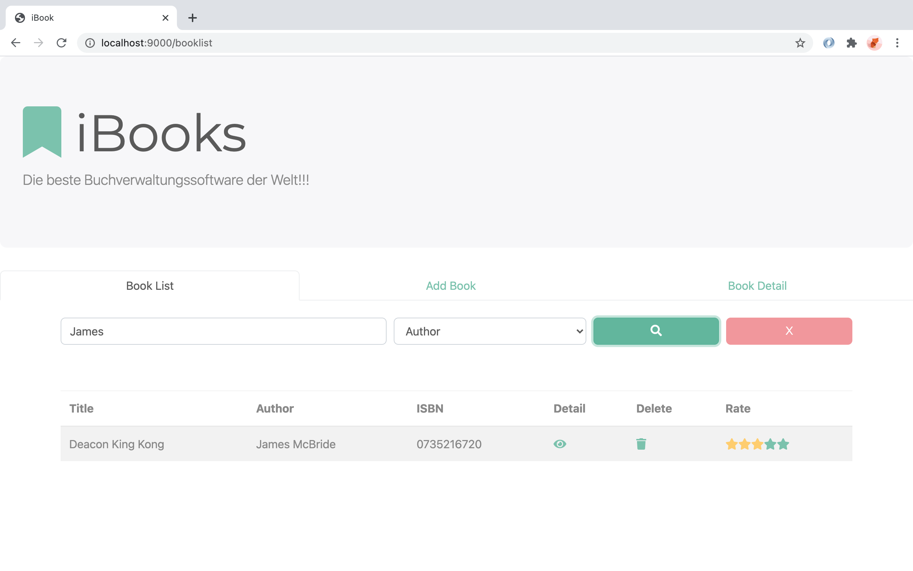
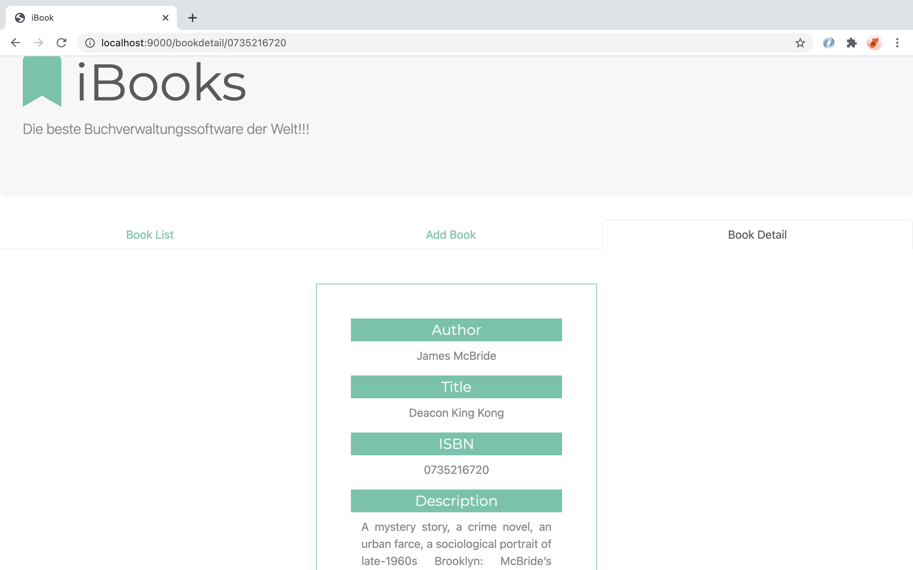

# MI-Proj-G1: iBooks
[[_TOC_]]

## Description
iBooks is an application to manage a collection of books. It provides functionalities for 

* adding books
* deleting books
* rating books
* searching the book collection

It uses the NodeJS Package Manager (npm).

## Prerequisites
For running the iBooks app, Node.js as well as the Node.js package manager should be installed on your system. 

Furthermore, access to a databank like Firebase is required. Ensure to add your .env file to the root layer of the repository.

## Installation
To  install and run the iBooks app in developer mode, run the following commands within the repository in \TL5:

`npm install`

`npm run dev` 

The app will run on port 9000.

## Usage
When running the app, the BookList view appears as default landing page. If no books have been added to the database yet, an empty table appears. Otherwise, a list of books that already are in the database is displayed.

## Functions 
The following diagram shows the  structure of the iBook App. Users can organize their favorite books online with iBook's functions by adding, deleting, rating and searching their books.     

## AddBook View

### Adding a Book
Adding a book can be done at the Add Book view. You get there either by clicking the "Add Book" tab in the navigation bar or by replacing "booklist" in the URI field with "addbook". A form with input fields for author, title, isbn and description of the book are displayed and all information on the book to be added can be filled in. 

Inputfields cannot be left empty and the isbn has to contain 10 digits to be valid. When one or more inputs are invalid, an error message that indicates what went wrong is displayed. According to the error message you can adjust your inputs. 

After filling out the form with valid inputs, the book can be added to the database by clicking the "Add Book" button below the form. After that, the user will be forwarded to the BookList view and can see the added book as the first element of the table.

In case you decide not to add a book you can return to the BookList view by clicking the respective tab in the navigation bar.

## BookList View
The BookList view displays author, title, isbn and rating of all books that are currently in the database. After adding a few books it will appear as below.

### Get more information about a book
If you want to get more information on a certain book, click the eye icon in the Detail colum of the table. 

After clicking you will be forwarded to the BookDetail view and can read the description of the book.

### Rating a Book
 Books can be given a rating from 1 to 5 as indicated by the number of yellow stars. After a book was added to the database, its default rating is set to 1 as seen in the picture below.

The rating can be updated by clicking the stars in the "Rate" column of the table. For example, by clicking at the third star, you would change the rating of the book to 3.

### Deleting a Book 
Deleting a book from the database can be done by clicking the waste bin icon in the row of the book to be deleted. 

After clicking, the book disappears from the BookList view by moving to the right as shown below. Simultaneously the book will be deleted from the database.

### Searching in the Stored Books 
Searching a specific book can be done using the search bar beneath the navigation bar of the BookList view. You can search for either title, author, or ISBN of a book. To do so, select the desired feature from the dropdown menu. Next, simply enter the search term in the input field on the left. 

By clicking on the green button with the magnifier glass icon, the search is performed on the list of already displayed books. Only books that match the search term and the search feature are now displayed in the book list.

If you wish to see all books again, simply click on the red button at the right of the search bar. Alternatively, you can narrow down the search further by entering a new search term.

## BookDetail View

At this page the author, title, isbn and description of a previously selected book are displayed. It is not possible to navigate to this view by clicking at the Book Detail tab, as a book has to be selected first. You can select a book by clicking at the detail button at the BookList View as described above (see section Get more information about a book).

If you wish to leave the Book Detail view you can go back to the BookList or the AddBook view by clicking the respective tabs in the navigation bar.

### Start documentation
To generate the JSDoc, run

`npm run doc`

in your terminal.

### Version
1.0.0

### Authors
<dl>
<dd>Fradtschuk, Evelyn </dd>
<dd>Lee, Yi-Shan </dd>
<dd>Ruschhaupt, Sonja Franziska </dd>
<dd>Sommermeier, Maren Frauke</dd>
<dd>Weise, Marcia </dd>
</dl>